# Using Rice to Explore Dataset Quality and Test the Limits of Computer Vision

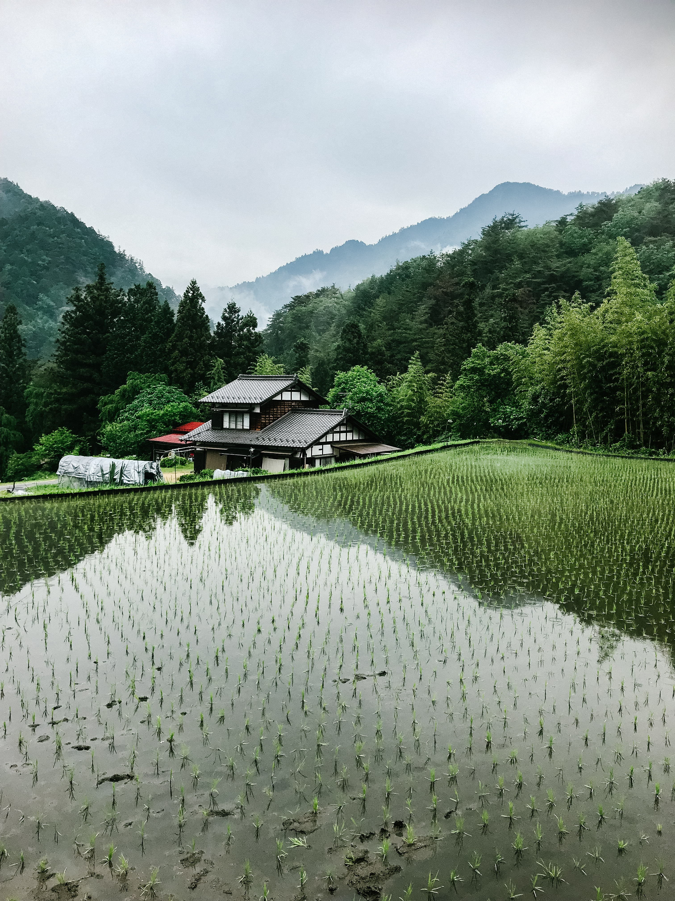

## Introduction

While on a recent work trip, I had the opportunity to learn about rice farming, and when a colleague told me a bit more about the logistics and distribution of rice through the supply chain, I became more intrigued on whether or not machine learning and computer vision could play a role in the supply chain.  At the start of the process, traditional IoT and more recent “smart farming” could certainly be applied to monitor rice paddy water levels, cameras could be deployed to watch seed growth and estimate plant height, and time-series dashboards could be built to monitor these factors.

But the supply chain and logistics of transporting and shipping rice, needs different solutions.  There is of course an IoT component once again, where temperature and humidity are monitored as rice is stored in large mounds, prior to being bagged or boxed for sale.  But one interesting problem experienced in the warehousing portion of the supply chain, is simply identifying what type of rice is even being stored and moved around.

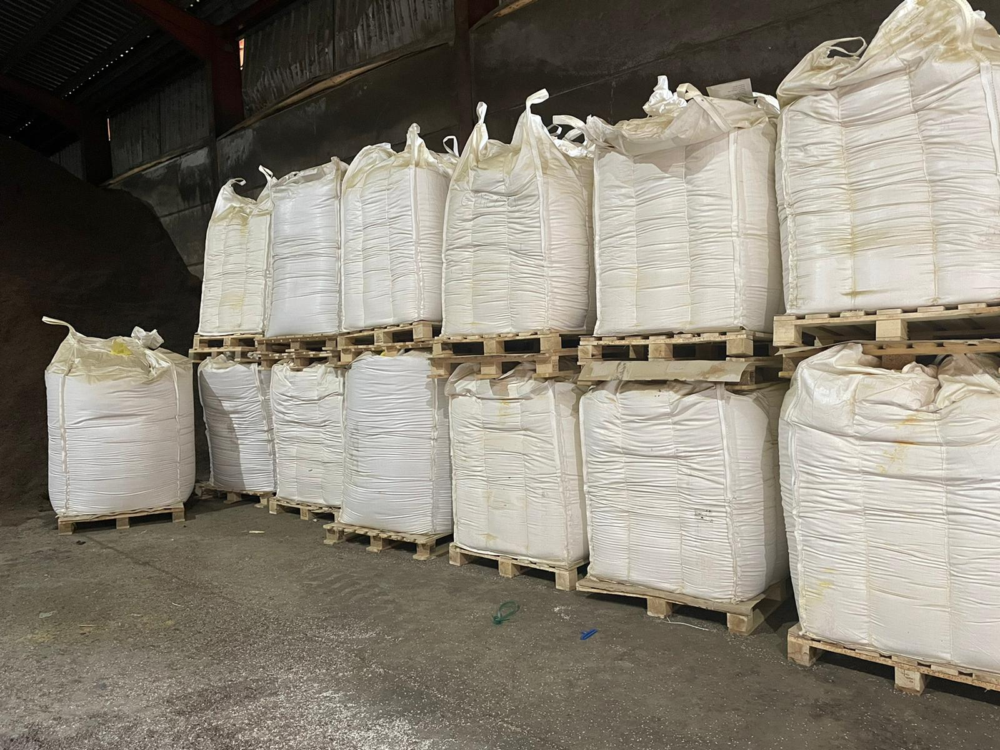

It turns out, there are experts who have enough experience with the various strains of rice that they can simply look at a few grains and identify the rice as Basmati, Jasmine, Ipsala, Arborio, or other varieties.  But to most common truck drivers, loading workers, and bulk storage staff, rice strains are indistinguishable from one another.  This prompted us to look closer at the problem, and explore the current limits of data and computer vision capabilities.

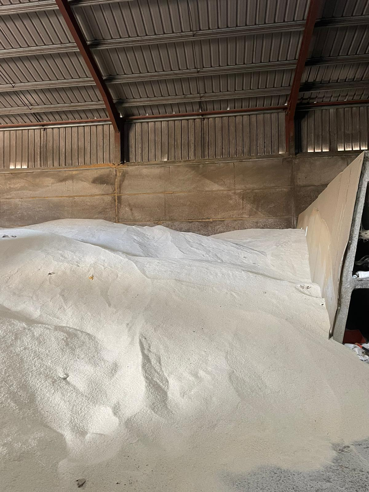

## Rice Classification

The goal of the project is to determine whether or not we can use Image Classification to accurately identify the variety of rice in front of a camera.  Generally speaking this means training a machine learning model on a dataset of known rice strains, and then deploying the model to a device to try to make accurate predictions of rice grain varieties.  We’ll use Edge Impulse in this project, to collect data, build the model, and deploy the model to a device.  

## Dataset Curation

Any machine learning project begins with capturing high quality data, to be curated into a dataset.  This process can be time consuming, but teams that invest in collecting high-quality data, can build high-quality machine learning models.  Poor data, not enough data, or unvaried data, can lead to models that are not accurate or not flexible enough to generalize to varying real-world conditions.  In this particular case, conditions will not vary too widely, as lighting and the target object (rice) will not deviate too greatly, but it is still a factor to always consider.

There are two ways to collect data for this project:

 - Use a ready-made dataset from a source like HuggingFace or Kaggle, where community members have spent time building large datasets for public use.
 - Take lots of pictures of the exact types of rice you want to attempt to classify, building your own dataset with your own data.

We are going to explore both in this project, as there are pros and cons to each, and some lessons learned along the way that are valuable to document.

## Existing Dataset

In an effort to speed up dataset collection, I had a look at Kaggle, and sure enough a generous community member has already gone through the time-consuming task of taking pictures of grains of rice.  In fact, the Rice Image Dataset from Murat Koklu has 75,000 pictures of rice grains split among 5 varieties.  So, I _could_ take 15,000 pictures each of a few varieties that I have, or I could just use his data.  So let’s go with his.  You can find the dataset here https://www.kaggle.com/datasets/muratkokludataset/rice-image-dataset, and download the .zip file.  Once you extract it, you will have 5 folders on your computer, named per the variety of rice, and each with 15,000 pictures in it.  Click on a few to have a look at them, and you will notice they are individual grains of rice, on a black background, 250 pixels by 250 pixels.

In Edge Impulse, create a new Project, give it a name, and click on Data Acquisition on the left.  Next, click on Upload Data at the top of the screen, and on this page you can select the files to upload (one class at a time, but you can do all 15,000 in one pass), Leave the default choice of **Automatically split between training and testing**, and be sure to type in a Label, corresponding to the type of rice images you are uploading.  So in this example, the Label is set to Arborio:

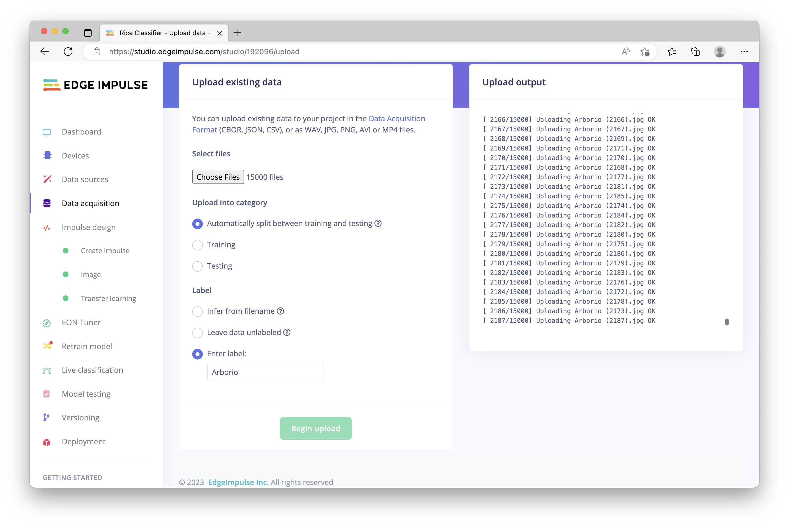

I then repeated this process for Basmati, and have left alone Jasmie, Ipsala, and Karakadac for now.

With the data in place, we can proceed to have a quick look at the images by clicking on Training Data at the top of the page, and then selecting a few images from the list of the images that were uploaded.  They are exactly as they appeared locally on your computer after you unzipped the Kaggle download.

Before we explore the alternative process, collecting your own data from pictures you take yourself, let’s proceed a few steps and see what happens if we use this dataset as-is and build a model.  

## Model Creation, Version 1

On the left, click on Create Impulse.  In the first block, Image Data, you can set the image to 250 by 250, as that is the size of our images from Kaggle.  Click on Add a Processing Block, and choose Image.  Click on Add a Learning Block, and choose Transfer Learning (Images).  Finally, click Save Impulse.

Next, click on Image on the left navigation, to load the Processing Block details.  We can leave RGB selected, and click Save Parameters.  Next, at the top, click Generate Features, and then click the green Generate Features button to start the process.  It will take a few minutes while it parses through all 30,000 images, but you will come away with a visualization of the dataset, that shows nice separation and clustering of the data.  

Click on Transfer Learning, on the left, to begin the process of training the model.  I am planning on running the model directly on a phone or tablet, as opposed to a microcontroller, so I am going to choose a large Neural network architecture to hopefully increase accuracy.  You can click on “Choose a different model” and have a look at the memory usage, and balance your needs accordingly, but I’ve selected **MobileNetv2 160x160 1.0** and I have bumped up the number of training cycles to 50.  At the bottom, click the green “Start Training” button.  This will take a while to complete.

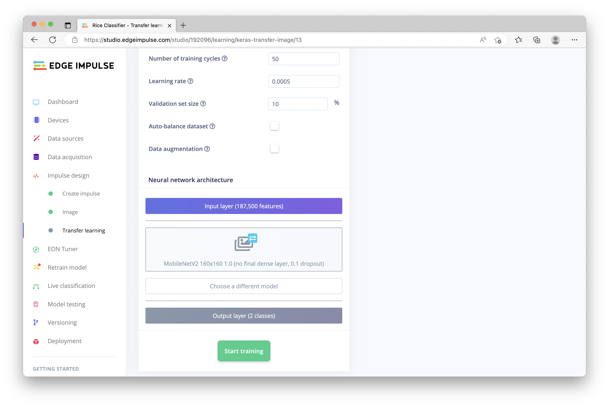

Once complete, we can see the results and expected accuracy of our model.  In this case, we are achieving an expected 100% accuracy, which seems a little too good to be true.  However, with such clear separation in the data, it may actually be possible.  To find out, we will test the model on some unseen data.  

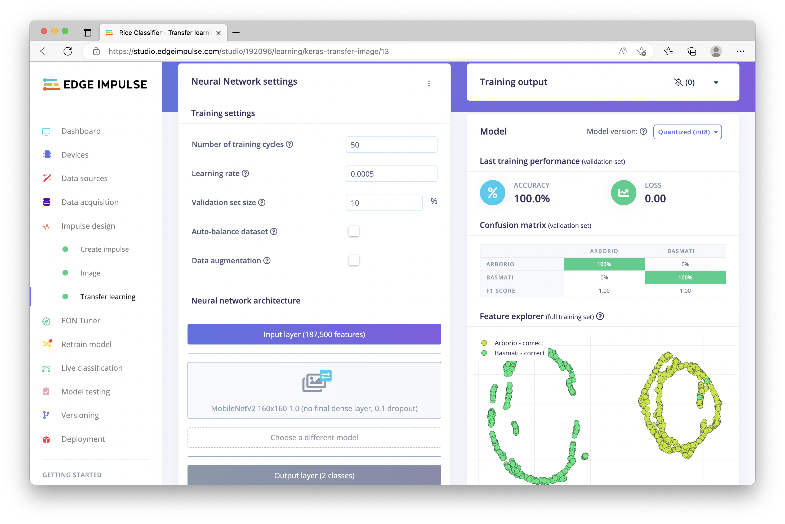

When we uploaded the images earlier, we left **Automatically split between training and testing** selected, which set aside a portion of images.  Those images were **not** used in the creation of the model, and we can now make use of them to see how the model behaves on these previously-unseen images.  Click on “Model Testing” on the left navigation, and click on “Classify all”.  This will take a few minutes to run, but will result in a total of 6,000 images being analyzed (3,000 from each class) and the results are displayed.  Again we are seeing essentially 100% accuracy, which might indicate the model is overfitting or may just be a result of good data!

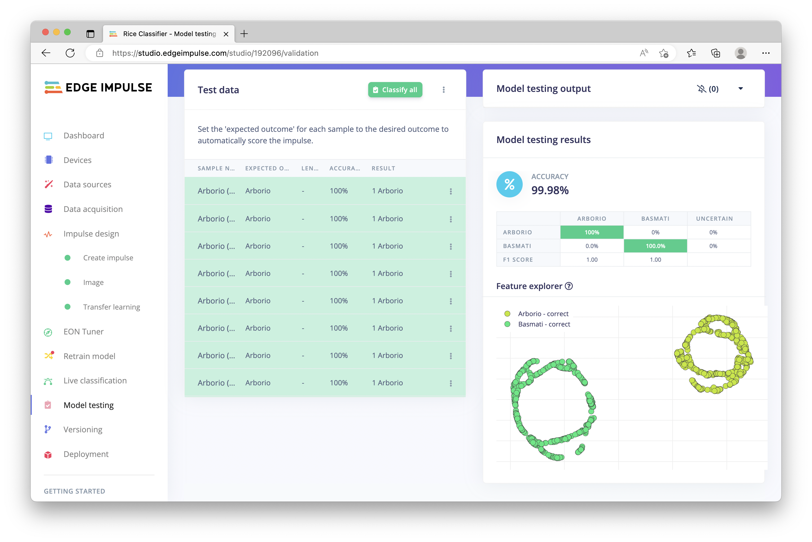

With Model Testing looking very encouraging, let’s go ahead and try out the model in the real world by using it directly on a smartphone.  Simply click on “Deployment” on the left, scroll down to the bottom and click on Smartphone, and click “Build”.  A modal will open up with a QR code, use your phone’s camera to scan the code and launch its web browser, the project will take a moment to compile, and then inferencing will begin right  on your phone!  

Now, grab some Arborio, and some Basmati, and give it a try.  I had to use a magnifying glass to get a bit closer to the rice, as my phone camera couldn’t focus closely enough without it.  But with a magnifying glass to zoom in closer, the model does indeed work, and can differentiate between Basmati and Arborio rice!

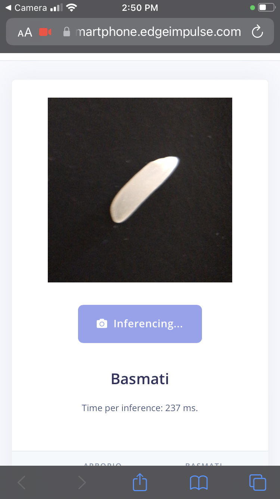

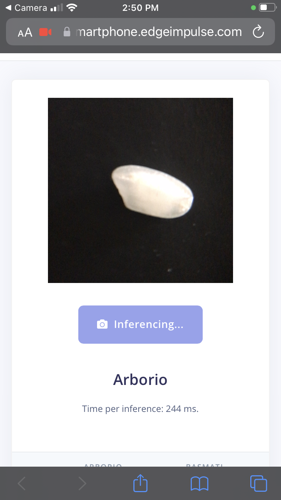

However, this works because these two varieties of rice do indeed look rather different.  Even my untrained eye can tell them apart, as the Basmati is longer and thinner, and the Arborio is shorter and wider.  They are different enough that the model can distinguish between them easily.  So, let’s try another variety of rice, and see what happens.

Returning to Data Acquisition (on the left navigation), click on the “Filter” icon to access the filtering options, and select Arborio (make sure Basmati is unchecked).  Then click on the “Select multiple items” icon, place a check in the header row to select all 12,000 Arborio images, and click the “Disable selected” button.  This will remove them from our Training, effectively eliminating them from our model.  Note that we did not **Delete** the data (though that is also possible to do), we are simply setting it inactive.  Now, let’s repeat the data upload process we performed earlier, this time selecting “Jasmine” and adding it to the dataset.  Click on Upload data at the top of the page, select all 15,000 images from the Jasmine folder, leave **Automatically split between training and testing** selected, enter “Jasmine” into the label box, and click “Begin upload”.

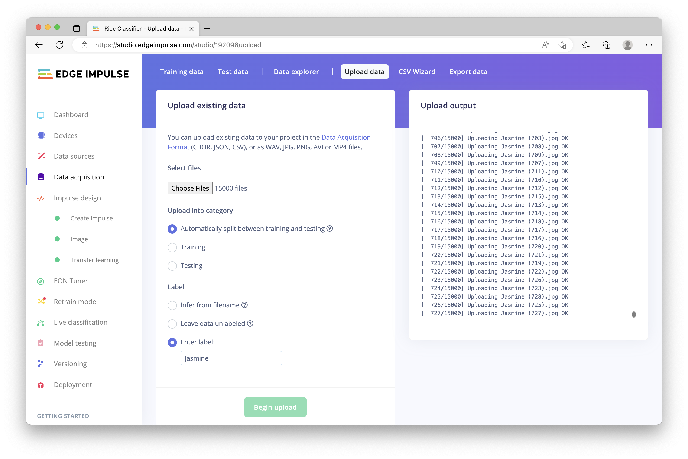

Once completed, the images will be added to the dataset, and we can go through the same steps as previously to build a model.  

## Model Creation, Version 2

Click on Create Impulse on the left navigation, and the settings will have persisted from our previous machine learning pipeline, though the class names will now reflect Basmati and Jasmine.  Click on Image on the left, once again leave RGB selected, click “Save parameters”, then proceed to “Generate features”.  Click the “Generate features” button, and wait while the data is analyzed.  At the end of the process, you will once again see a visual representation of the dataset, but note that the discreet objects have significant overlap this time.  These two classes are much closer in observed features, with significant overlapping in the circular structure.  This may not bode well for the classification model we are about to construct.

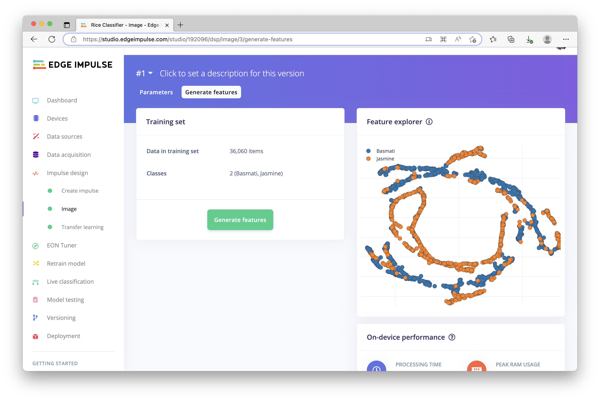

To find out, click on Transfer Learning on the left, verify that the settings match the previous training cycle we performed earlier, and click “Start Training”.  Like last time, this will take a while, but once completed we can immediately see that this model is a little bit less confident in predictions, and once again the data overlaps significantly in the Feature Explorer view.  We can also use the Model Testing feature to let the model do a test run on the unseen data like last time, but as this project is simple enough to deploy, we’ll jump straight to running it again on the phone.  

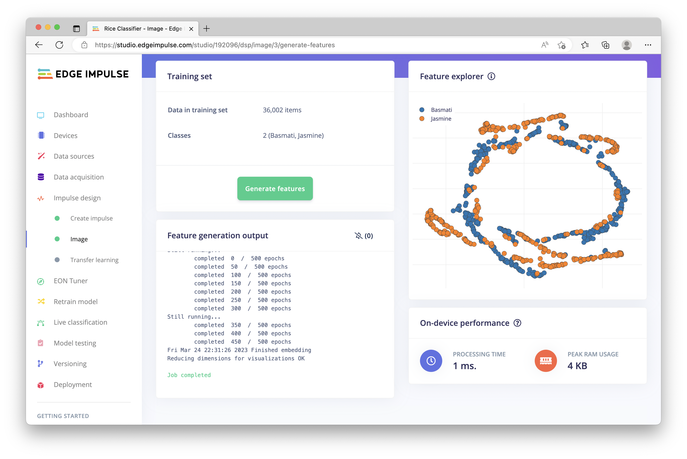

You can use the QR code to once again launch inferencing directly in the phone’s browser, and placing a few grains of Basmati and a few grains of Jasmine next to each other, I found that the model is far less accurate, and has trouble correctly identifying the species of rice.  In some cases, it is simply incorrect, in others the model flips back and forth between Basmati, Jasmine, or “Uncertain”, meaning it simply can’t figure out which variety it is.  Of course, it did get some correct, but overall the model was not reliable enough to consider it a success.  Perhaps additional training cycles could help, or, modifying parameters and creating a fine-tuned model can help improve functionality.  But let’s also consider the dataset for a moment.  Essentially, we used *someone else’s** data, and while it’s great they made their work public, unless we replicate their exact conditions, our environment does not match their environment.  Do we know anything about the lighting they used?  Do we know the exact distance from the camera to the rice grain, and what level of zoom they used?  What about the pure black background, which I do not have replicated here?  Thus, with 15,000 images exhibiting those pre-defined conditions, but my local conditions not being an exact match, our model is not generalized enough to be effective in my situation.  

While it was convenient to use ready-made data, unless we replicate the precise conditions used when those images of rice were collected, our model performance will suffer.  

That leads us to the second method of collecting data for a machine learning project, which is certainly more time consuming but can hopefully lead to more accurate results and a better-performing computer vision model:  Collecting your own data. 

## Collect Your Own Dataset

Now that we have explored the “quicker” method of using an existing dataset, which as you can see may or may not work reliably for your machine learning projects, we can return to the earlier point of dataset quality and capturing data yourself.  This will take much longer, but for enterprise machine learning projects at scale, having a dataset that you know represents real-world conditions, aligns to the environmental conditions of your deployed devices, and simply knowing what is in the data will have a dramatic effect on the outcome of your project.  In this particular case, this means we need to collect several hundred pictures of grains of rice.  Eliminating the pure black background, having a consistent level of zoom that matches my phone, and lighting in my room will better align our images being fed into the model creation, hopefully resulting in a model that is more accurate upon deployment back to the phone later.

